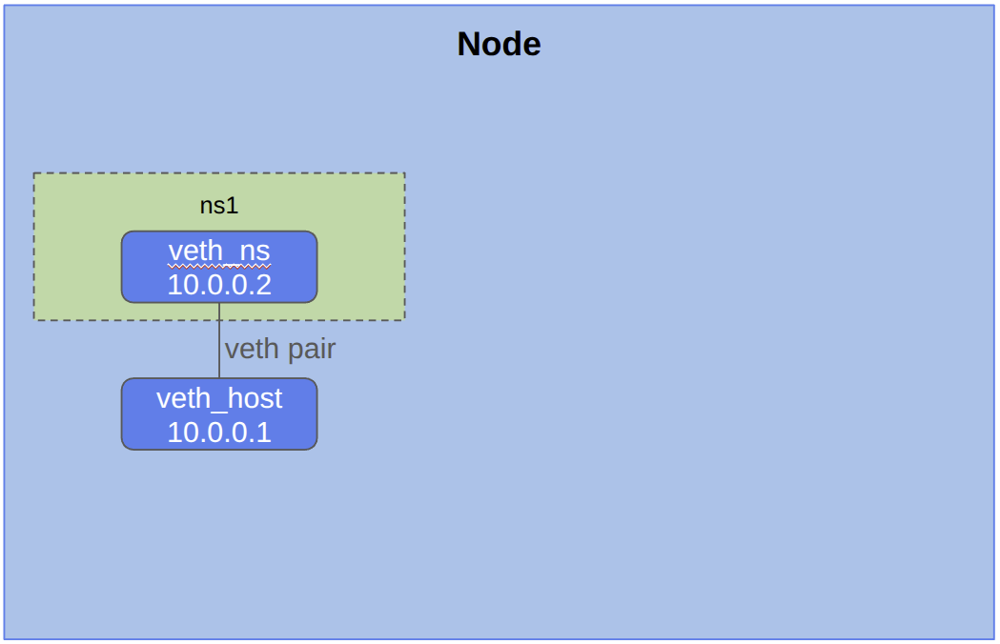

# Setup communication between host and namespace

## Create the vEth pair

```
cd /assets/scenarios/02-veth
./02-root.sh
``` {{exec target=node hidden=true text="Start"}}

## Ping the host from the namespace

```
PS1="\[\e[1m\][demo]$ \[\e[0m\] "
cd /assets/scenarios/02-veth
./02-namespace.sh
``` {{exec target=ns hidden=true text="Start"}}


## Ping the namespace from the host

```
go


``` {{exec target=node hidden=true text="Start"}}



