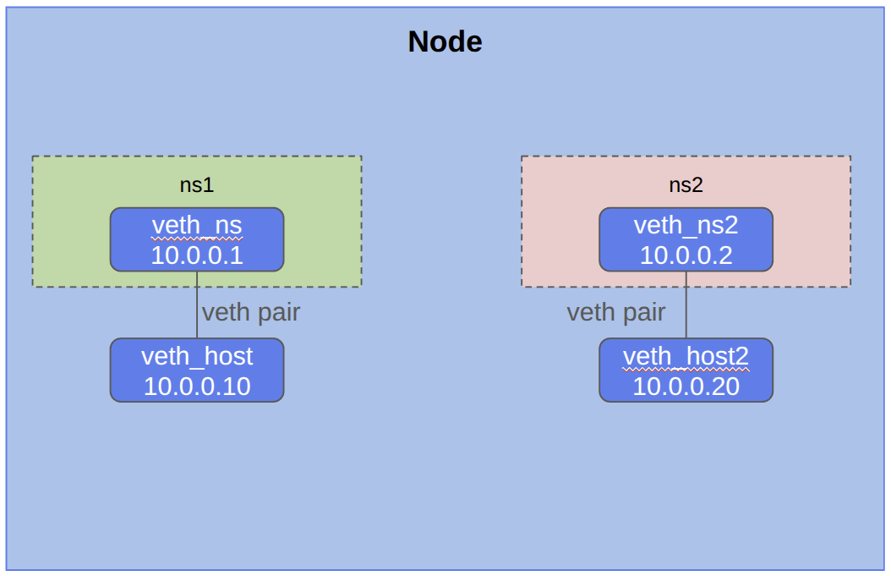
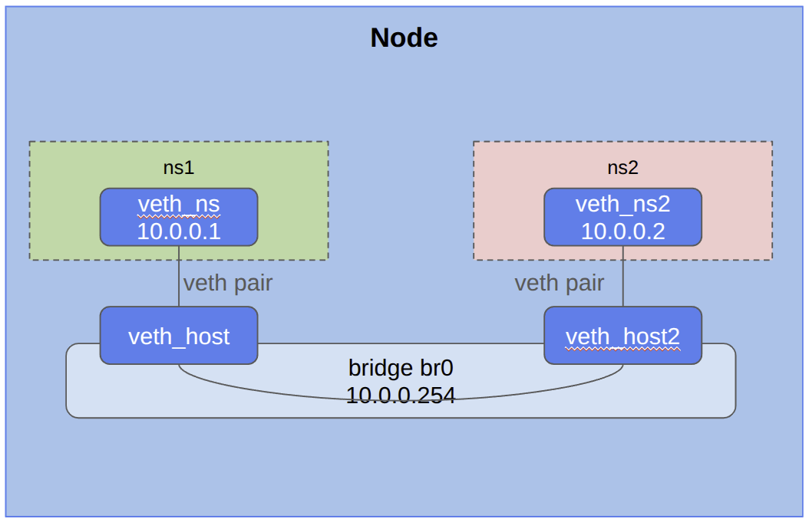

# Create a second namespace

## Create a second namespace ns2

```
cd /assets/scenarios/03-multi
./03-root.sh
``` {{exec target=node hidden=true text="Start"}}



## Try to ping ns1 from ns2

```
cd /assets/scenarios/03-multi
./03-namespace.sh
``` {{exec target=ns hidden=true text="Start"}}


## Create a bridge

```
go

``` {{exec target=node hidden=true text="Start"}}


## Check connectivity between ns1 and ns2

```
go

``` {{exec target=ns hidden=true text="Start"}}

## Check connectivity from host to ns1 and ns2

```
go

``` {{exec target=node hidden=true text="Start"}}




## TCP demo

### Start a server in ns1

```
cd /assets/scenarios/04-com
./04-ns1.sh
``` {{exec target=node hidden=true text="Start"}}

### Start a client in ns2

```
cd /assets/scenarios/04-com
./04-ns2.sh
``` {{exec target=ns hidden=true text="Start"}}

### Send messages

```
Hello from RockDemo !
``` {{exec target=ns hidden=true text="Send"}}

```
exit
``` {{exec target=ns hidden=true text="Stop client"}}


```
Server stopped 
``` {{exec interrupt target=node hidden=true text="Stop server"}}

