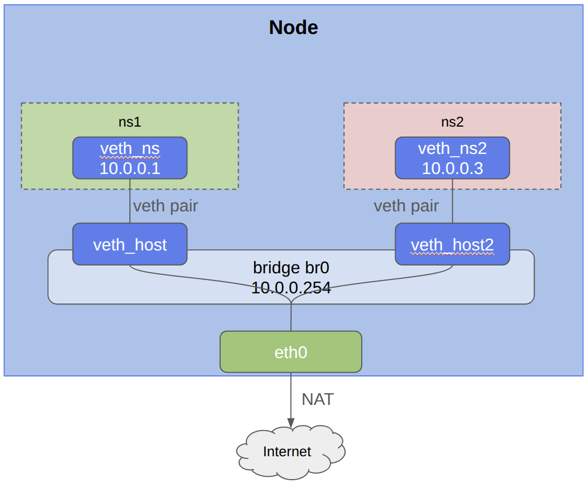

# Hello World !

## Test external connectivity

```
cd /assets/scenarios/05-out
./05-root.sh
``` {{exec target=node hidden=true text="Start"}}

## Try to ping an external IP from the ns1

```
cd /assets/scenarios/05-out
./05-namespace.sh
``` {{exec target=ns hidden=true text="Start"}}


## Setup NAT on host

```
go
``` {{exec target=node hidden=true text="Start"}}

## Test external connectivity again from ns1

```
go


``` {{exec target=ns hidden=true text="Start"}}


