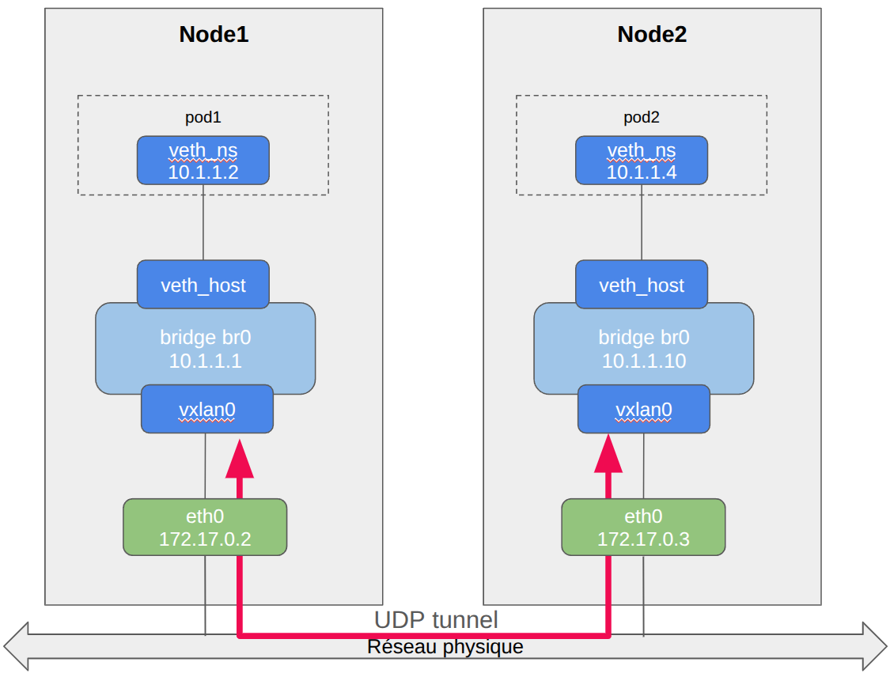

## Connect to node1 and setup namespace

Check connectivity within node1

```
cd /assets/scenarios/06-multi
./06-node1.sh
``` {{exec target=node hidden=true text="Create node1"}}


## Connect to node2 and setup namespace

Check connectivity within node2 and between nodes<br />
Create a tunnel from node2 to node1

```
cd /assets/scenarios/06-multi
./06-node2.sh
``` {{exec target=ns hidden=true text="Create node2"}}


## Setup the connection from node1 to node2

Create a tunnel from node1 to node2<br />
Check connectivity between node2 and node1

```
go
``` {{exec target=node hidden=true text="Start"}}


## Check connectivity

Check connectivity between node1 and node2

```
go
``` {{exec target=ns hidden=true text="Start"}}



