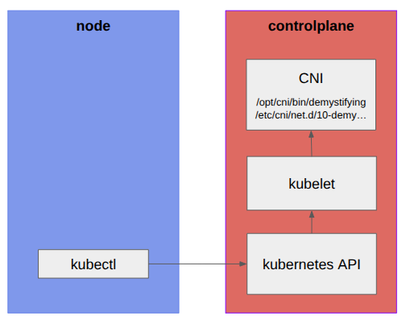

# Install a CNI in Kubernetes

## CNI configuration

Inspect the CNI configuration

```text
/assets/scenarios/07-cni/10-demystifying.conf
```{{open}}

## CNI structure

Inspect the CNI structure

```text
/assets/scenarios/07-cni/cni.sh
```{{open}}


## CNI implementation

Inspect the CNI implementation

```text
/assets/scenarios/07-cni/demystifying
```{{open}}

## Install the CNI in a real cluster



```
cd /assets/scenarios/07-cni
./07-demo.sh
``` {{exec target=node hidden=true text="Run demo"}}
